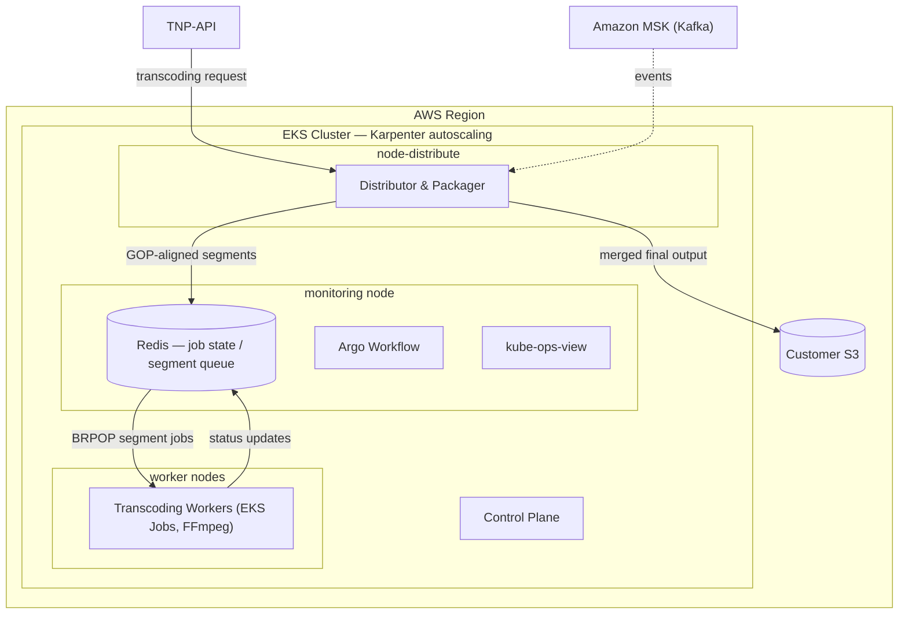
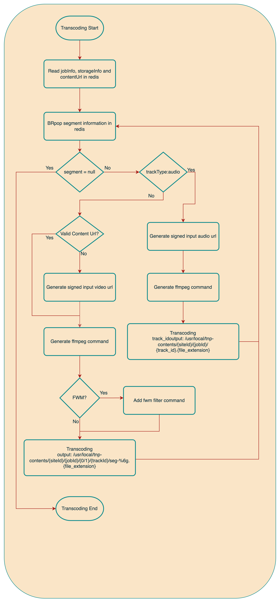

# Distributed Transcoding System

## 1. Overview

This project is a **distributed transcoding system** designed to efficiently process large video files.  
By dividing videos into GOP-aligned segments and processing them in parallel,  
then merging the transcoded pieces into a final result, the system replaced a  
Hybrik-based external SaaS — **cutting encoding cost 50% and lifting throughput 30%**,  
while ensuring **scalability** and **system stability**.

---

## 2. Problem

- Transcoding large video files on a single server causes bottlenecks
- The previous Hybrik-based external SaaS was cost-prohibitive and inelastic at scale
- Fixed resource usage limits scalability and cost efficiency

---

## 3. Solution

- Split video files into **GOP-aligned segments** and process them **in parallel**
- Each segment is processed as an individual **EKS Job**
- Use **Redis** to track job status and coordinate distributed tasks
- Merge transcoded chunks in sequence to generate the final video

---

## 4. System Architecture

> The diagram below illustrates the overall architecture of the distributed transcoding system:

---

## 5. Transcoding Flow

> The diagram below outlines the complete flow from transcoding request to final output:  

---

## 6. Key Technical Highlights

- **Optimized Parallelism**: Distributed transcoding via EKS Jobs
- **GOP-Aware Segmentation**: Segments cut on GOP boundaries so each piece transcodes independently without re-encoding artifacts at seams
- **Efficient Resource Utilization**: Maximize compute usage with segmented parallel processing
- **Scalability**: Number of jobs dynamically scales with video length and load
- **State Management**: Real-time tracking of each segment's status using Redis, with auto-failover job control

---

## 7. Results

- **50% encoding cost reduction** vs the previous Hybrik-based SaaS
- **30% throughput improvement**
- Self-hosted on AWS EKS with dynamic scaling (Karpenter)

---